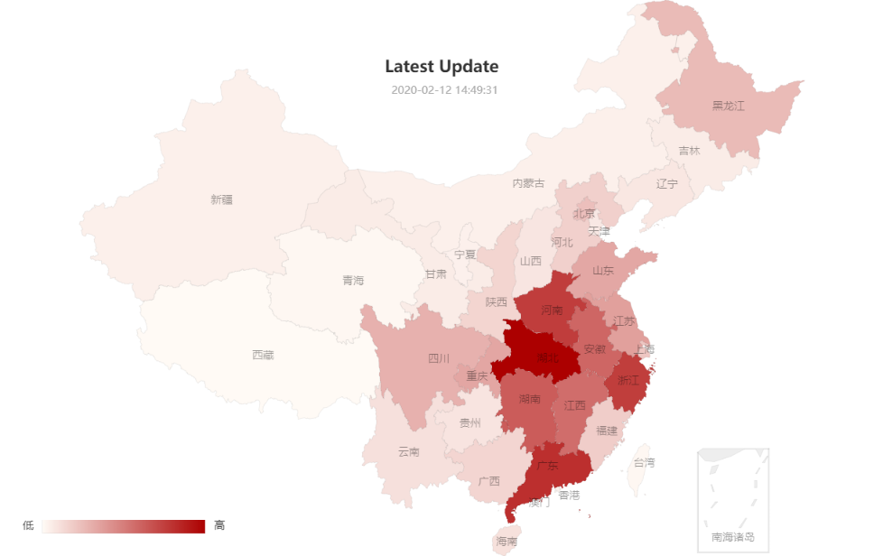
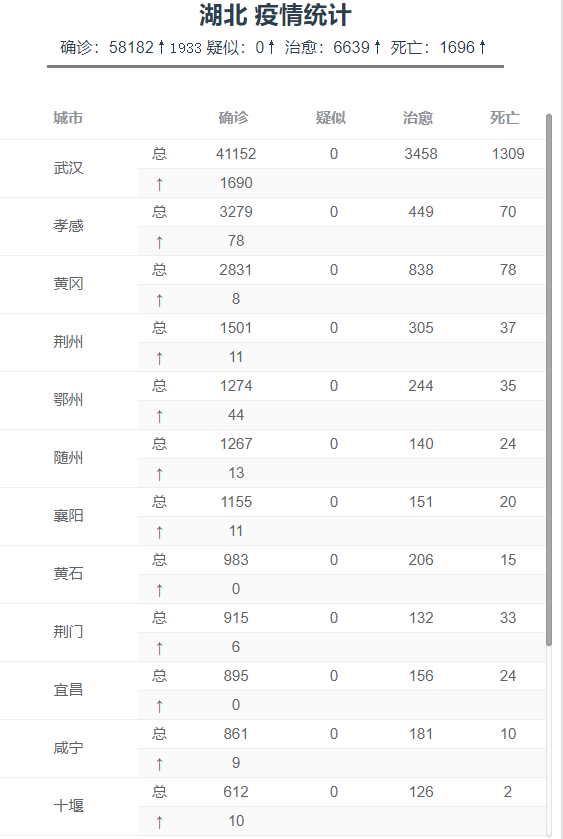

# coronavirus-distribution

> Already can be seen at [coronavirus-distribution.netlify.com](coronavirus-distribution.netlify.com)

A simple website visualizing the novel coronavirus distribution data by graph and table(list), not professional and just for fun
* vue ^2.6.11
* echarts, element-ui
* axios
* netlify

---

Two parts: a graph and a correspondent list

* Graph

* List

Deployed at netlify app, it may be hard to access inland.
To myself, I was having trouble fixing across-origin problems when I finally found it was just because I failed to fetch some of the websites's resources without VPN............

note: *all the data come from [link](https://view.inews.qq.com/g2/getOnsInfo?name=disease_h5) and data structure may change from the day on, which can cause the missing data or error on the graph and list*
